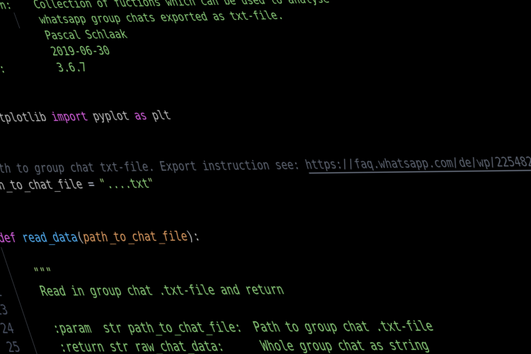

# Project: Whatsapp Data Analysis 

This repository contains functions written in python to analyse a whatsapp group chat.

## Getting Started

These instructions will help you to run the script on your maschine. First of all you need `python3` installed, as well as following packages:

~~~
matplotlib==2.1.1
~~~

### Installing

Before running the script clone the repository to your desired directory:

~~~
cd /path/to/desired/directory
git clone git@github.com:Schlagoo/whatsapp_data_analysis.git
~~~

Afterwards you need to export your whatsapp group chat ([see here](https://faq.whatsapp.com/wp/22548236)).

Now you need to define the path to your whatsapp .txt-file. Therefore open the `whatsapp_data_analysis.py` with your editor or ide of choice and declare the `path_to_chat_file` variable.

Next read the function documentaries to choose one of the two options (run help(function-name) or read it inline):

1. count_messages_and_words_by_name
2. show_activity_by_time

After calling the desired function with all arguments, you can run the script from the terminal (linux) via:

(Make shure you the file is executable: `sudo chmod +x whatsapp_data_analysis.py`!)

~~~
./whatsapp_data_analysis.py
~~~

## Built with

* [Python 3.6.8](https://www.python.org/) - Programming language
* [Matplotlib](https://matplotlib.org/) - Plotting library

## Author

* **Pascal Schlaak** - *Student/intern at BMW* - [Schlagoo](https://github.com/Schlagoo)
